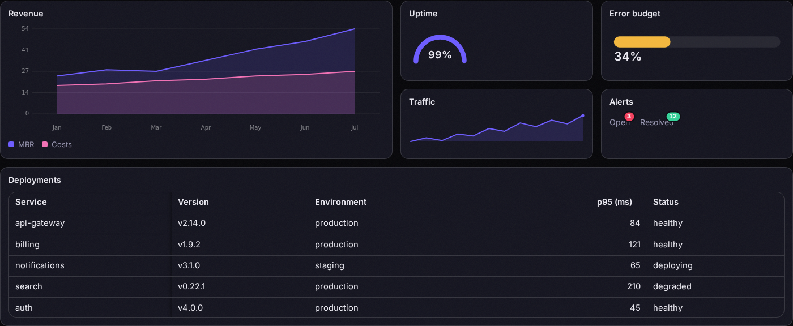

# aurora

> Enterprise UI that moves like it means it — 105 animated components, from data grids to gauges, shipped as native Web Components.

[](https://github.com/lasitosPT/aurora/actions/workflows/ci.yml)
[](https://www.npmjs.com/package/@lasitospt/aurora)


**🌐 [Live demo & docs → auroralib.com](https://auroralib.com)**



_Everything above is aurora — the draggable tiles, the chart, the gauges, the badges, and the
frozen-column grid. [It's live on the landing page.](https://auroralib.com#showcase)_

`aurora` ships as native **Web Components** (custom elements), so it works in **any** stack — React,
Vue, Svelte, or plain HTML — with no wrapper and no config. Styles are encapsulated in Shadow DOM and
themed with CSS variables; motion is powered by GSAP, and the 3D components use Three.js.

Highlights beyond the usual suspects:

- **Enterprise data**: a full grid (multi-sort, operator filters, grouping, frozen columns,
  virtualization, edit validation, CSV + Excel export via an in-house OOXML writer), TreeList,
  PivotGrid, ListView, Scheduler with four views, and a drag-editable Gantt
- **25+ form editors**, all form-associated via ElementInternals and tied together by
  `<aurora-form>`'s validation harness
- **In-house encoders**: QR codes (Reed-Solomon, spec mask scoring) and Code 128 barcodes,
  both verified bit-for-bit against reference implementations
- **Composition all the way down**: the wizard composes the stepper, the date-time picker
  composes the calendar, the org chart composes avatars, the dropdown-tree composes the treeview

## Install

```bash
npm install @lasitospt/aurora
```

```ts
import '@lasitospt/aurora' // registers the core components
import '@lasitospt/aurora/three' // registers the Three.js components (3D deps load only here)
```

Then use the elements anywhere:

```html
<aurora-text><h1>Motion, built in.</h1></aurora-text>

<aurora-magnetic strength="0.5">
  <aurora-button>Hover me</aurora-button>
</aurora-magnetic>

<aurora-tilt max="14">
  <div class="card">Tilt me toward your cursor.</div>
</aurora-tilt>

<aurora-marquee speed="80">GSAP · Three.js · Web Components · </aurora-marquee>

<aurora-scene color="#6d5cff" speed="1.2"></aurora-scene>
```

Because they're standard custom elements, you write them the same way in JSX, Vue templates, or HTML.

## Components

Every component has a [documentation and tutorial page](https://auroralib.com/docs.html).

### Enterprise & Data

| Component                                                                      | What it does                                                                                  |
| ------------------------------------------------------------------------------ | --------------------------------------------------------------------------------------------- |
| `<aurora-barcode>` [↗](https://auroralib.com/docs.html?c=aurora-barcode)       | Code 128 barcodes from an in-house, spec-verified encoder                                     |
| `<aurora-chart>` [↗](https://auroralib.com/docs.html?c=aurora-chart)           | Grouped bars, multi-series lines, and donuts on a DPR-aware canvas                            |
| `<aurora-chat>` [↗](https://auroralib.com/docs.html?c=aurora-chat)             | A conversation view with sided bubbles, avatar initials, a typing indicator, and a composer   |
| `<aurora-gantt>` [↗](https://auroralib.com/docs.html?c=aurora-gantt)           | Project timelines                                                                             |
| `<aurora-gauge>` [↗](https://auroralib.com/docs.html?c=aurora-gauge)           | Arc, circular, and linear gauges in one SVG element                                           |
| `<aurora-grid>` [↗](https://auroralib.com/docs.html?c=aurora-grid)             | A virtualized enterprise data grid: multi-column sorting, filtering, global search, paging, … |
| `<aurora-listview>` [↗](https://auroralib.com/docs.html?c=aurora-listview)     | A templated, data-bound list                                                                  |
| `<aurora-orgchart>` [↗](https://auroralib.com/docs.html?c=aurora-orgchart)     | Reporting lines from nested data                                                              |
| `<aurora-pivotgrid>` [↗](https://auroralib.com/docs.html?c=aurora-pivotgrid)   | Cross flat records into a matrix                                                              |
| `<aurora-qrcode>` [↗](https://auroralib.com/docs.html?c=aurora-qrcode)         | A dependency-free QR generator                                                                |
| `<aurora-scheduler>` [↗](https://auroralib.com/docs.html?c=aurora-scheduler)   | A week-view scheduler: day columns over hour rows, time-positioned events with accent colors… |
| `<aurora-sparkline>` [↗](https://auroralib.com/docs.html?c=aurora-sparkline)   | A tiny inline chart that draws itself into view                                               |
| `<aurora-tilelayout>` [↗](https://auroralib.com/docs.html?c=aurora-tilelayout) | A dashboard grid                                                                              |
| `<aurora-treelist>` [↗](https://auroralib.com/docs.html?c=aurora-treelist)     | A hierarchical data grid                                                                      |

### Forms & Inputs

| Component                                                                                        | What it does                                                                                  |
| ------------------------------------------------------------------------------------------------ | --------------------------------------------------------------------------------------------- |
| `<aurora-autocomplete>` [↗](https://auroralib.com/docs.html?c=aurora-autocomplete)               | A type-to-filter suggestion input: matches highlight as you type, arrows and Enter select, E… |
| `<aurora-calendar>` [↗](https://auroralib.com/docs.html?c=aurora-calendar)                       | A month-view calendar with a Monday-first grid, an outlined today, ISO value, and a complete… |
| `<aurora-checkbox>` [↗](https://auroralib.com/docs.html?c=aurora-checkbox)                       | A form-associated checkbox whose check draws itself on                                        |
| `<aurora-colorpalette>` [↗](https://auroralib.com/docs.html?c=aurora-colorpalette)               | A fixed swatch grid for brand-constrained picking                                             |
| `<aurora-colorpicker>` [↗](https://auroralib.com/docs.html?c=aurora-colorpicker)                 | A full HSV picker built from CSS gradients                                                    |
| `<aurora-dateinput>` [↗](https://auroralib.com/docs.html?c=aurora-dateinput)                     | Type a date without a popup                                                                   |
| `<aurora-datepicker>` [↗](https://auroralib.com/docs.html?c=aurora-datepicker)                   | A date input that opens the aurora-calendar in a popup                                        |
| `<aurora-daterange>` [↗](https://auroralib.com/docs.html?c=aurora-daterange)                     | Pick a span in one grid: first click starts it, second ends it (reversed picks swap themselv… |
| `<aurora-datetimepicker>` [↗](https://auroralib.com/docs.html?c=aurora-datetimepicker)           | Calendar and clock in one popup                                                               |
| `<aurora-dropdowntree>` [↗](https://auroralib.com/docs.html?c=aurora-dropdowntree)               | A select whose popup is a full treeview                                                       |
| `<aurora-durationpicker>` [↗](https://auroralib.com/docs.html?c=aurora-durationpicker)           | Type a duration as hh:mm:ss                                                                   |
| `<aurora-editor>` [↗](https://auroralib.com/docs.html?c=aurora-editor)                           | A contenteditable editor with a stateful toolbar                                              |
| `<aurora-form>` [↗](https://auroralib.com/docs.html?c=aurora-form)                               | A validation harness for every aurora editor                                                  |
| `<aurora-input>` [↗](https://auroralib.com/docs.html?c=aurora-input)                             | A text field with an animated focus underline; form-associated and event-transparent          |
| `<aurora-listbox>` [↗](https://auroralib.com/docs.html?c=aurora-listbox)                         | The classic dual-list pattern                                                                 |
| `<aurora-masked>` [↗](https://auroralib.com/docs.html?c=aurora-masked)                           | A pattern-masked input: define the shape once (# digit, A letter, * alphanumeric), literals … |
| `<aurora-multicolumncombobox>` [↗](https://auroralib.com/docs.html?c=aurora-multicolumncombobox) | A combobox that drops a table                                                                 |
| `<aurora-multiselect>` [↗](https://auroralib.com/docs.html?c=aurora-multiselect)                 | A pick-many dropdown: selections become removable chips, the popup is a checkbox list, and t… |
| `<aurora-numeric>` [↗](https://auroralib.com/docs.html?c=aurora-numeric)                         | A numeric spinner with honest math: typed values are clamped to min/max and snapped to the s… |
| `<aurora-otp>` [↗](https://auroralib.com/docs.html?c=aurora-otp)                                 | A segmented code input that behaves the way users expect: typing advances, Backspace retreat… |
| `<aurora-radiogroup>` [↗](https://auroralib.com/docs.html?c=aurora-radiogroup)                   | A WAI-ARIA radio group                                                                        |
| `<aurora-rating>` [↗](https://auroralib.com/docs.html?c=aurora-rating)                           | A star rating that pops as you pick. Any glyph, any scale, keyboard-rateable, and it submits… |
| `<aurora-select>` [↗](https://auroralib.com/docs.html?c=aurora-select)                           | An animated dropdown list. Options come from child <option> elements or the options property… |
| `<aurora-signature>` [↗](https://auroralib.com/docs.html?c=aurora-signature)                     | A signature pad that draws smoothed SVG strokes and submits them with your form as a data URL |
| `<aurora-slider>` [↗](https://auroralib.com/docs.html?c=aurora-slider)                           | A draggable, keyboard-accessible range slider with role="slider" and honest min/max/step math |
| `<aurora-switch>` [↗](https://auroralib.com/docs.html?c=aurora-switch)                           | An animated toggle with role="switch"                                                         |
| `<aurora-textarea>` [↗](https://auroralib.com/docs.html?c=aurora-textarea)                       | A textarea that grows with its content and counts characters live against maxlength           |
| `<aurora-timepicker>` [↗](https://auroralib.com/docs.html?c=aurora-timepicker)                   | An HH:MM input with scrollable hour and minute columns; the minute increment is yours to set… |
| `<aurora-upload>` [↗](https://auroralib.com/docs.html?c=aurora-upload)                           | A drag-and-drop file zone with keyboard browsing, animated per-file rows, size limits with e… |

### Actions & Navigation

| Component                                                                        | What it does                                                                                   |
| -------------------------------------------------------------------------------- | ---------------------------------------------------------------------------------------------- |
| `<aurora-actionsheet>` [↗](https://auroralib.com/docs.html?c=aurora-actionsheet) | A bottom sheet of actions                                                                      |
| `<aurora-appbar>` [↗](https://auroralib.com/docs.html?c=aurora-appbar)           | A sticky frosted-glass header with three slot regions                                          |
| `<aurora-bottomnav>` [↗](https://auroralib.com/docs.html?c=aurora-bottomnav)     | A frosted bottom bar with one active destination                                               |
| `<aurora-breadcrumb>` [↗](https://auroralib.com/docs.html?c=aurora-breadcrumb)   | A breadcrumb trail with a custom separator; the last item is the current page and hrefless c…  |
| `<aurora-button>` [↗](https://auroralib.com/docs.html?c=aurora-button)           | The themeable base button                                                                      |
| `<aurora-buttongroup>` [↗](https://auroralib.com/docs.html?c=aurora-buttongroup) | A segmented control: options in, one active segment out, with aria-pressed state and a pop o…  |
| `<aurora-chips>` [↗](https://auroralib.com/docs.html?c=aurora-chips)             | A chip list for filters and tags: single or multiple selection with a pop, optional remove b…  |
| `<aurora-command>` [↗](https://auroralib.com/docs.html?c=aurora-command)         | A ⌘K command palette: global hotkey, type-to-filter over labels and keywords, arrow/Enter/Es…  |
| `<aurora-contextmenu>` [↗](https://auroralib.com/docs.html?c=aurora-contextmenu) | Right-click menus for any element                                                              |
| `<aurora-fab>` [↗](https://auroralib.com/docs.html?c=aurora-fab)                 | A floating action button                                                                       |
| `<aurora-menu>` [↗](https://auroralib.com/docs.html?c=aurora-menu)               | An animated dropdown with arrow-key roving, Escape-with-focus-restore, and outside-click close |
| `<aurora-splitbutton>` [↗](https://auroralib.com/docs.html?c=aurora-splitbutton) | A primary action with an attached dropdown of alternatives                                     |
| `<aurora-stepper>` [↗](https://auroralib.com/docs.html?c=aurora-stepper)         | Multi-step progress with accent-filled connectors, checkmarked completed steps, and a pop on…  |
| `<aurora-tabs>` [↗](https://auroralib.com/docs.html?c=aurora-tabs)               | Tabbed panels with an animated active indicator and the WAI-ARIA tabs keyboard pattern (arro…  |
| `<aurora-toolbar>` [↗](https://auroralib.com/docs.html?c=aurora-toolbar)         | A responsive toolbar                                                                           |
| `<aurora-treeview>` [↗](https://auroralib.com/docs.html?c=aurora-treeview)       | Hierarchical navigation from a nested items array                                              |
| `<aurora-wizard>` [↗](https://auroralib.com/docs.html?c=aurora-wizard)           | Multi-step flows with a built-in stepper, animated direction-aware transitions, and a cancel…  |

### Overlays & Feedback

| Component                                                                        | What it does                                                                                  |
| -------------------------------------------------------------------------------- | --------------------------------------------------------------------------------------------- |
| `<aurora-accordion>` [↗](https://auroralib.com/docs.html?c=aurora-accordion)     | A collapsible panel with animated height and correct aria-expanded state                      |
| `<aurora-avatar>` [↗](https://auroralib.com/docs.html?c=aurora-avatar)           | Image avatars that never break: no src (or a failed load) falls back to initials on a gradie… |
| `<aurora-badge>` [↗](https://auroralib.com/docs.html?c=aurora-badge)             | Notification badges that pop when the count changes                                           |
| `<aurora-confetti>` [↗](https://auroralib.com/docs.html?c=aurora-confetti)       | A celebration cannon on a full-viewport canvas                                                |
| `<aurora-drawer>` [↗](https://auroralib.com/docs.html?c=aurora-drawer)           | A side panel sliding from either edge with the modal’s focus discipline: Tab trap, Escape, f… |
| `<aurora-loader>` [↗](https://auroralib.com/docs.html?c=aurora-loader)           | Indeterminate spinners in three flavors                                                       |
| `<aurora-modal>` [↗](https://auroralib.com/docs.html?c=aurora-modal)             | An animated dialog with real focus discipline: focus moves in on open, Tab is trapped at sha… |
| `<aurora-popover>` [↗](https://auroralib.com/docs.html?c=aurora-popover)         | An anchored floating panel for rich contextual content                                        |
| `<aurora-progressbar>` [↗](https://auroralib.com/docs.html?c=aurora-progressbar) | A determinate bar that tweens to every value change with a live percentage                    |
| `<aurora-skeleton>` [↗](https://auroralib.com/docs.html?c=aurora-skeleton)       | Shimmering loading placeholders                                                               |
| `<aurora-splitter>` [↗](https://auroralib.com/docs.html?c=aurora-splitter)       | Two resizable panes and a draggable divider                                                   |
| `<aurora-toaster>` [↗](https://auroralib.com/docs.html?c=aurora-toaster)         | A glassmorphic toast stack with variant icon badges, an optional title, and a progress hairl… |
| `<aurora-tooltip>` [↗](https://auroralib.com/docs.html?c=aurora-tooltip)         | A one-line hover/focus tooltip with four placements                                           |
| `<aurora-videoplayer>` [↗](https://auroralib.com/docs.html?c=aurora-videoplayer) | Custom chrome over native video                                                               |
| `<aurora-window>` [↗](https://auroralib.com/docs.html?c=aurora-window)           | A floating window you can drag by its title bar                                               |

### Text & Typography

| Component                                                                      | What it does                                                          |
| ------------------------------------------------------------------------------ | --------------------------------------------------------------------- |
| `<aurora-glitch>` [↗](https://auroralib.com/docs.html?c=aurora-glitch)         | An RGB-split, slice-clipped glitch burst over text                    |
| `<aurora-scramble>` [↗](https://auroralib.com/docs.html?c=aurora-scramble)     | Text decodes through random glyphs, left to right                     |
| `<aurora-shine>` [↗](https://auroralib.com/docs.html?c=aurora-shine)           | A soft highlight sweeps across text on a loop                         |
| `<aurora-text>` [↗](https://auroralib.com/docs.html?c=aurora-text)             | Masked text that rises into view on scroll                            |
| `<aurora-typewriter>` [↗](https://auroralib.com/docs.html?c=aurora-typewriter) | Types its text behind a blinking accent caret when scrolled into view |

### Motion & Interaction

| Component                                                                  | What it does                                                                                   |
| -------------------------------------------------------------------------- | ---------------------------------------------------------------------------------------------- |
| `<aurora-carousel>` [↗](https://auroralib.com/docs.html?c=aurora-carousel) | Drag or swipe with GSAP inertia and slide snapping; arrow keys and a programmatic API included |
| `<aurora-compare>` [↗](https://auroralib.com/docs.html?c=aurora-compare)   | A before/after slider                                                                          |
| `<aurora-dock>` [↗](https://auroralib.com/docs.html?c=aurora-dock)         | Children magnify as the cursor approaches                                                      |
| `<aurora-flip>` [↗](https://auroralib.com/docs.html?c=aurora-flip)         | A 3D flip between two faces                                                                    |
| `<aurora-magnetic>` [↗](https://auroralib.com/docs.html?c=aurora-magnetic) | Wrapped content is pulled toward the cursor as it approaches and springs back on leave         |
| `<aurora-marquee>` [↗](https://auroralib.com/docs.html?c=aurora-marquee)   | A seamless infinite scroller                                                                   |
| `<aurora-orbit>` [↗](https://auroralib.com/docs.html?c=aurora-orbit)       | Children revolve around optional slot="center" content                                         |
| `<aurora-parallax>` [↗](https://auroralib.com/docs.html?c=aurora-parallax) | Children with data-depth drift toward the pointer at their own depth and settle back on leave  |
| `<aurora-ripple>` [↗](https://auroralib.com/docs.html?c=aurora-ripple)     | A soft ripple expands from the pointer on press, clipped to the wrapper’s radius               |
| `<aurora-sortable>` [↗](https://auroralib.com/docs.html?c=aurora-sortable) | Drag-to-reorder for anything                                                                   |
| `<aurora-tilt>` [↗](https://auroralib.com/docs.html?c=aurora-tilt)         | 3D perspective tilt that follows the pointer across the surface and eases back on leave        |

### Scroll & Page

| Component                                                                  | What it does                                                                      |
| -------------------------------------------------------------------------- | --------------------------------------------------------------------------------- |
| `<aurora-counter>` [↗](https://auroralib.com/docs.html?c=aurora-counter)   | A number that counts up when seen                                                 |
| `<aurora-cursor>` [↗](https://auroralib.com/docs.html?c=aurora-cursor)     | A trailing glow ring that follows the pointer and grows over interactive elements |
| `<aurora-progress>` [↗](https://auroralib.com/docs.html?c=aurora-progress) | A fixed gradient hairline at the top of the viewport tracking reading position    |
| `<aurora-reveal>` [↗](https://auroralib.com/docs.html?c=aurora-reveal)     | Fades and rises any content the first time it scrolls into view                   |
| `<aurora-timeline>` [↗](https://auroralib.com/docs.html?c=aurora-timeline) | A vertical milestone timeline                                                     |

### Visual & 3D

| Component                                                                    | What it does                                                                                |
| ---------------------------------------------------------------------------- | ------------------------------------------------------------------------------------------- |
| `<aurora-beam>` [↗](https://auroralib.com/docs.html?c=aurora-beam)           | A luminous beam travelling the border of any card, continuously                             |
| `<aurora-lens>` [↗](https://auroralib.com/docs.html?c=aurora-lens)           | An image that liquifies toward the cursor with a chromatic fringe                           |
| `<aurora-nebula>` [↗](https://auroralib.com/docs.html?c=aurora-nebula)       | The aurora-borealis backdrop from this site’s hero                                          |
| `<aurora-particles>` [↗](https://auroralib.com/docs.html?c=aurora-particles) | A drifting GPU particle field with additive glow, a two-tone gradient, and pointer parallax |
| `<aurora-scene>` [↗](https://auroralib.com/docs.html?c=aurora-scene)         | A rotating wireframe icosahedron backdrop                                                   |
| `<aurora-spotlight>` [↗](https://auroralib.com/docs.html?c=aurora-spotlight) | A card whose interior glow and 1px border beam follow the cursor                            |
| `<aurora-wave>` [↗](https://auroralib.com/docs.html?c=aurora-wave)           | A wireframe ocean                                                                           |

## Theming

Every component reads CSS custom properties (with sensible fallbacks). Set them on `:root` or on any
ancestor — they pierce the shadow boundary:

```css
:root {
  --aurora-accent: #6d5cff;
  --aurora-accent-hover: #5a49e0;
  --aurora-radius: 0.6rem;
}
```

All components respect `prefers-reduced-motion` and disable animation when the user asks for it.

## Try the demo

A full showcase with live components and copy-paste docs is deployed at
**[auroralib.com](https://auroralib.com)**.

To run it locally:

```bash
cd site
npm install
npm run dev
```

Or open the standalone example (after `npm run build` at the root):

```bash
npx serve   # then open examples/index.html
```

## Development

```bash
npm run lint && npm run typecheck && npm run test && npm run build
```

Tests run in `happy-dom`, so custom-element registration, attributes, and Shadow DOM structure are
verified in CI.

## License

[MIT](LICENSE) © Pedro Lascasas Pinto
